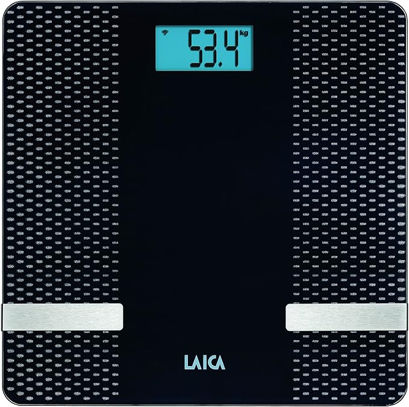

# Laica PS7002 BLE Research

<p align="center">
  
</p>

Independent reverse-engineering and interoperability research for the **Laica PS7002 Smart** body-composition scale and the wider **YoHealth** BLE scale family.

The project passively receives BLE advertising packets, decodes the final measurement and reproduces the complete body-composition result generated by the historical YoHealth `getHealth()` routine.

> **Status:** the PS7002 BLE frame, checksum, weight, final-measurement detection and the core body-composition algorithm have been validated against real measurements. Historical Android source has also resolved the meaning of all eight `getHealth()` output fields: BMI, body fat, water, muscle, bone mass, visceral fat, body age and BMR.

## Compatibility scope

The **Laica PS7002 Smart** is the directly validated reference device for this repository.

The project is intentionally broader than one model. Historical source and documentation for the related **Laica PS7200L** use the same `YoHealth` BLE name, packet family and `getHealth()` implementation. We therefore want to determine how widely the protocol and algorithm are shared across other Laica/YoHealth scales.

Compatibility with another model is **not assumed** until tested. Reports from other devices are especially welcome through the included GitHub Issue Forms.

See [COMPATIBILITY.md](COMPATIBILITY.md).

## What has been recovered

### BLE protocol

A complete PS7002 body-composition result is broadcast without pairing or a GATT connection. The observed NimBLE manufacturer data has this form:

```text
02 A1 09 FF WW WW ZZ ZZ SS FF FF MM CC AA
```

For the reference frame:

```text
02 A1 09 FF 03 27 02 99 86 FF FF 21 15 AA
```

we decode:

```text
weight       = 80.7 kg
impedance    = 665
status       = 0x86, stable body-composition result
mode         = 0x21, body-composition scale with 0.1 kg resolution
checksum     = valid
```

The historical Android app source also reveals that byte `MM` is a **device type / precision code**, not an unexplained constant. See [PROTOCOL.md](PROTOCOL.md).

### YoHealth algorithm

Historical Android source establishes the native call signature:

```text
getHealth(sex, age, height_cm, weight_kg, impedance)
```

and maps the eight returned fields to:

```text
0  BMI
1  body fat
2  water
3  muscle
4  bone mass
5  visceral fat
6  body age
7  BMR
```

This mapping removes the previous `native metric X/Y` uncertainty. See [ALGORITHM.md](ALGORITHM.md) and [REVERSE_ENGINEERING.md](REVERSE_ENGINEERING.md).

## Validation status

For the original reference profile and measurement:

```text
sex        male
age        55
height     175 cm
weight     80.7 kg
impedance  665
```

we obtain:

| Metric | Recovered result | Current PS7002 app |
|---|---:|---:|
| BMI | 26.3510 | 26.35 |
| Body fat | 23.2862 % | 23.28 % |
| Water | 56.0010 % | 56 % |
| Muscle | 38.7309 % | 38.73 % |

A subsequent real PS7002 weighing was also reported to match **all metrics exposed by the current app**, including BMR.

The historical YoHealth source additionally identifies **bone mass, visceral fat and body age**. These are calculated by the firmware, although the current PS7002 app used for validation does not expose all of them in its UI.

## Repository layout

```text
.
├── README.md
├── PROTOCOL.md
├── ALGORITHM.md
├── REVERSE_ENGINEERING.md
├── COMPATIBILITY.md
├── VALIDATION.md
├── REFERENCES.md
├── CONTRIBUTING.md
├── NOTICE.md
├── CHANGELOG.md
├── LICENSE
├── assets/
│   └── laica-ps7002.png
├── firmware/
│   └── Laica_PS7002_Research/
│       └── Laica_PS7002_Research.ino
├── tools/
│   ├── yohealth_calc.py
│   └── selftest.py
└── data/
    ├── README.md
    └── measurements-template.csv
```

## Hardware and software

- ESP32 with BLE support
- Arduino IDE or compatible build environment
- [NimBLE-Arduino](https://github.com/h2zero/NimBLE-Arduino), 2.x API
- Serial monitor at **115200 baud**

## Quick start

1. Install `NimBLE-Arduino`.
2. Open `firmware/Laica_PS7002_Research/Laica_PS7002_Research.ino`.
3. Set the profile constants to match the companion app:

```cpp
static constexpr bool    PROFILE_MALE      = true;
static constexpr uint8_t PROFILE_AGE_YEARS = 55;
static constexpr float   PROFILE_HEIGHT_CM = 175.0f;
```

4. Flash the ESP32 and open Serial Monitor at 115200 baud.
5. Perform a complete barefoot body-composition measurement.
6. Wait for `FINAL MEASUREMENT`.

The logger ignores unrelated BLE traffic, validates the YoHealth framing/checksum and emits a single final result per weighing session.

## Example output

```text
FINAL MEASUREMENT #1

Weight                   : 80.70 kg
Impedance / health       : 665
BMI                      : 26.35
Lean mass (internal)     : 61.908 kg
Body fat                 : 23.29 %
Water                    : 56.00 %
Muscle                   : 38.73 %
Bone mass (YoHealth)     : 2.856 kg
Visceral fat (YoHealth)  : 10.48 %
Body age (YoHealth)      : 67 years
BMR                      : 1673 kcal/day
```

Some current Laica apps may hide bone mass, visceral fat and body age even though those fields are produced by the historical YoHealth algorithm.

## Offline calculator

The same calculations are implemented independently in Python:

```bash
python3 tools/yohealth_calc.py \
  --weight 80.7 \
  --impedance 665 \
  --height 175 \
  --age 55 \
  --male
```

Run the regression test with:

```bash
python3 tools/selftest.py
```

## Validation and contributions

The repository includes structured GitHub Issue Forms for:

- a **sample measurement / algorithm validation**;
- a **device compatibility report**;
- a **bug report**.

The validation campaign is useful both for confirming formulas over more measurements and for determining which other Laica/YoHealth models share the same protocol.

See [VALIDATION.md](VALIDATION.md) and [CONTRIBUTING.md](CONTRIBUTING.md).

## Confidence terminology

- **CONFIRMED** — directly observed on the PS7002 and/or matched against current app output.
- **SOURCE-MAPPED** — user-facing meaning recovered directly from the historical YoHealth Android source.
- **RECOVERED** — numerical behavior reconstructed from the native implementation.
- **OPEN** — still requires protocol or cross-device validation.

## Provenance and licensing

This repository contains original interoperability code and documentation released under the **MIT License**.

Historical proprietary/decompiled YoHealth/Laica material is **not redistributed** and is **not relicensed** by this project. It was used as an external reverse-engineering reference. See [NOTICE.md](NOTICE.md) and [REFERENCES.md](REFERENCES.md).

The project is not affiliated with or endorsed by Laica or the original YoHealth software authors.

## Safety / intended use

Consumer BIA body-composition values are estimates. This project is for interoperability, personal automation and protocol research; it is not a medical device and should not be used for diagnosis or clinical decision-making.

## License

MIT. See [LICENSE](LICENSE).
